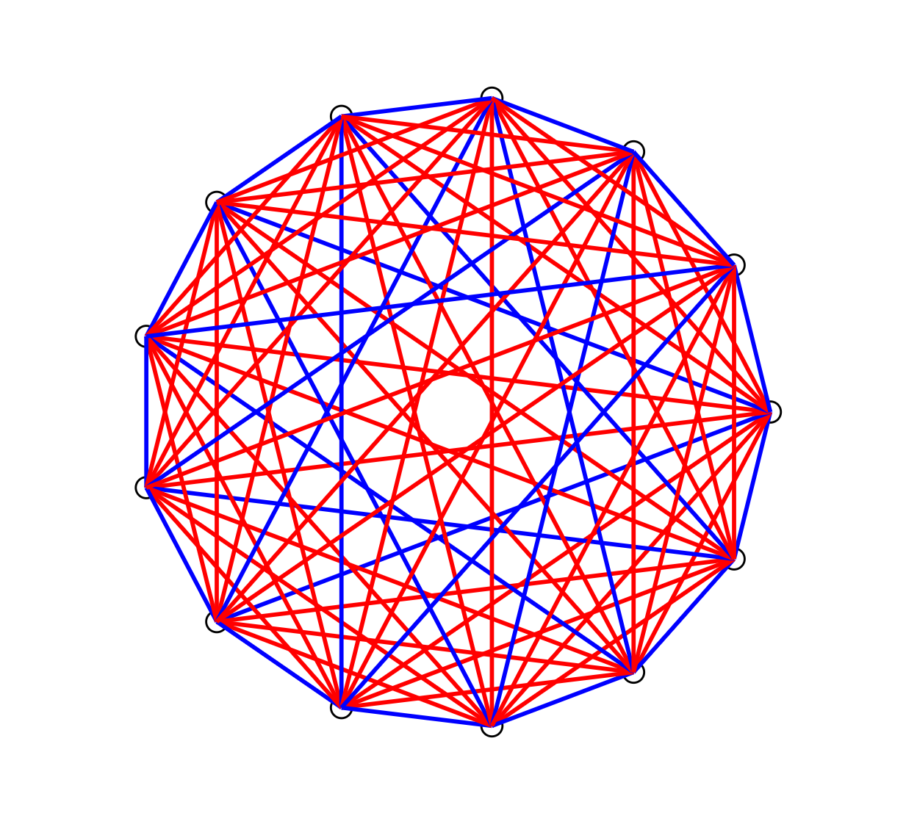

## About Me

> "We must know. We will know." — David Hilbert

Hi, my name is Cruise (or you might know me as Congyan). I am a second-year Ph.D. student in Computer Science at the [Georgia Institute of Technology](https://www.gatech.edu/), advised by [Prof. Vijay Ganesh](https://vganesh1.github.io/). Before that, I obtained my B.S. in Mathematics and Computer Science from the [University of Michigan](https://umich.edu/), where I was fortunate to work with [Prof. Jean-Baptiste Jeannin](https://jeannin.github.io/) on formal verification of numerical methods. I have also been working on formalizing Ramsey theory with [Dr. David E. Narváez](https://scholar.google.com/citations?user=3Q9FMWgAAAAJ&hl=en), who introduced me to the wonderful field of formal methods.

## Research Interests

I am broadly interested in **formal verification**, particularly the following topics:

- Formalization of Mathematics
- Verification of Parsers & Compilers
- Theorem Proving & Automated Reasoning
- Autoformalization & Neurosymbolic AI

<figure style="text-align: center;">
   13" style="height: 260px;"/>
  <figcaption style="font-size: 12px; color: gray;">Ramsey (5,3) &gt; 13. Visualized by a Lean widget I wrote :D</figcaption>
</figure>

Formal verification is the pursuit of trust and guarantees for systems ranging from mathematics to software. My earlier work focused on formalizing mathematics such as Ramsey theory with Lean 4 and SAT solvers, producing machine-checkable proofs that bring reliability and rigor to mathematical research.

More recently, I have become interested in the verification of parsers and compilers, where the goal is to guarantee a faithful translation from an input language to an output language. To me, this is what makes verification so compelling: it bridges abstract, high-level intent and its concrete realization in the real world.

## News

- **[2026]** Our paper [“Just Draw It: Widgets for Generating and Visualizing Graph Structures in Lean 4”](https://conf.researchr.org/home/splash-issta-2026/hatra-2026) was accepted to [HATRA 2026](https://conf.researchr.org/home/splash-issta-2026/hatra-2026), co-located with SPLASH/ISSTA 2026.
- **[2026]** I interned at the [Amazon Automated Reasoning group (Verified Permissions)](https://aws.amazon.com/verified-permissions/) as an Applied Scientist Intern, where I am grateful to work with [Dr. Liana Hadarean](https://scholar.google.com/citations?user=MocRuzIAAAAJ&hl=en) on verifying Cedar parsers in Lean.
- **[2025]** I spent an amazing summer interning at [Imandra](https://www.imandra.ai/about), collaborating closely with [Dr. Grant Passmore](https://scholar.google.com/citations?user=7aGYQF8AAAAJ&hl=en) on integrating Imandra-geo into Lean to handle nonlinear real arithmetic.
- **[2024]** My first publication, [“Formalizing Finite Ramsey Theory in Lean 4”](https://link.springer.com/chapter/10.1007/978-3-031-66997-2_6), was accepted to [CICM 2024](https://cicm-conference.org/2024/cicm.php)!
- **[2024]** I attended the [Summer School on Formal Techniques](https://fm.csl.sri.com/SSFT24/), and I highly recommend peers interested in this field to attend!


